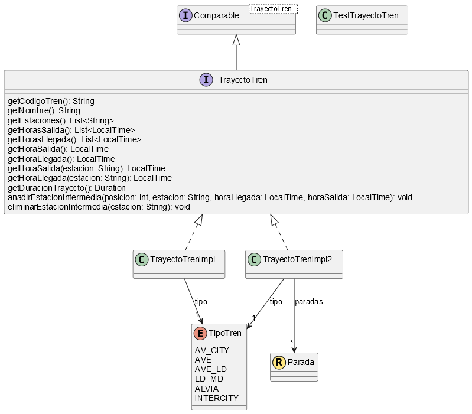

## Fundamentos de Programación
# Ejercicio de laboratorio: Trayecto Trenes
**Autor:** Toñi Reina. 
**Revisores:** Mariano González, José María Luna. 
**Última modificación:** 03/03/2025

El objetivo de este proyecto es doble: Por una parte, se quiere diseñar una aplicación que recoja información de trayectos de trenes, tal y como se muestra en la siguiente tabla, y, por otra parte se quiere mostrar cómo una interfaz sirve como un contrato para el diseño de un tipo, que puede ser implementado de dos formas distintas, para lo que usaremos un esquema interfaz (**TrayectoTren**)+ claseimpl (**TrayectoTrenImpl**)+ claseimpl2 (**TrayectoTrenImpl2**).

Para gestionar esta información se ha diseñado el tipo **TrayectoTren**, con las siguientes propiedades y operaciones:

Propiedades:

- **Código del Tren**, de tipo String, consultable.
- **Nombre del Trayecto**, de tipo String, consultable.
- **Tipo**, de tipo TipoTren, consultable. TipoTren puede tomar los valores AV\_CITY, AVE, AVE\_LD, LD\_MD, ALVIA, INTERCITY.
- **Estaciones**, de tipo List<String>, consultable. Contiene los nombres de las estaciones en las que para el tren. El orden en la lista se corresponde con el orden de las estaciones en el trayecto. Para el ejemplo anterior, el primer elemento de la lista sería SEVILLA-SANTA JUSTA y el último MADRID-PUERTA DE ATOCHA.
- **Horas Salida**, de tipo List<LocalTime>, consultable. Contiene las horas de salida del tren de las estaciones que se recorren durante el trayecto. La primera hora de salida se corresponde con la hora de salida del tren de la primera estación del trayecto, mientras que la última debe ser null, por corresponder a la última estación.
- **Horas Llegada**, de tipo List<LocalTime>, consultable. Contiene las horas de llegada del tren a las estaciones que se recorren durante el trayecto. La primera hora de llegada debe ser null, por corresponder a la primera estación del trayecto, mientras que la última se corresponde con la hora de llegada del tren a la última estación.
- **Hora Salida**, de tipo LocalTime. Representa la hora de salida del tren de la primera estación del trayecto.
- **Hora Llegada**, de tipo LocalTime. Representa la hora de llegada del tren a la última estación del trayecto.
- **Duración Trayecto**, de tipo Duration. Duración de todo el trayecto, desde que sale el tren de la primera estación hasta que llega a la última.

Constructores: 

- C1: recibe los siguientes parámetros: el código del tren, el nombre del trayecto, el tipo de tren, la estación origen del trayecto, la estación final del trayecto, la hora de salida de la estación origen y la hora de llegada a la última estación del trayecto. Este constructor creará un trayecto con dos estaciones, las de origen y destino. La hora de salida de la estación origen será la dada como parámetro, mientras que la hora de llegada de la estación origen será null. La hora de llegada de la última estación será la dada como parámetro y la hora de salida será null.

Restricciones:

- R1: el código de un tren debe estar formado por 5 dígitos.
- R2: la hora de salida de la primera estación no puede ser nula.
- R3: la hora de llegada a la última estación no puede ser nula.
- R4: la hora de salida de la primera estación debe ser anterior a la hora de llegada a la última estación.

Otras operaciones:

- **LocalTime getHoraSalida(String estacion)**: devuelve la hora en la que parte el tren de la estación dada como parámetro. Si la estación no está en el trayecto, o la estación es la última, devuelve null.
- **LocalTime getHoraLlegada(String estacion)**: devuelve la hora en la que llega el tren a la estación dada como parámetro. Si la estación no está en el trayecto, o la estación es la primera, devuelve null.
- **void anadirEstacionIntermedia(int posicion, String estacion, LocalTime horaLlegada, LocalTime horaSalida)**: añade al trayecto una estación intermedia cuyo nombre, hora de llegada del tren y hora de salida son los dados como parámetros. La estación se añadirá en la posición o índice dado como primer parámetro. Esta operación eleva *IllegalArgumentException* en los siguientes casos: (1) si la posición no es una posición intermedia (es decir, debe ser siempre mayor o igual que uno y menor que el número de estaciones); (2) si la hora de salida es anterior a la de llegada; (3) si la hora de llegada es anterior a la hora de salida de la estación anterior; (4) si la hora de salida es posterior a la hora de llegada a la estación siguiente. 
- **void eliminarEstacionIntermedia(String estacion)**: elimina del trayecto la estación dada como parámetro. Eleva *IllegalArgumentException* si la estación a eliminar es la primera o la última del trayecto o si no está en el trayecto.

Representación como cadena: el nombre del trayecto, seguido de un guion, el tipo de tren, seguido del código del tren entre paréntesis, y después, por cada estación, el nombre de la estación, un tabulador, la hora de llegada a la estación, un tabulador y la hora de salida; para la de origen la hora de llegada se dejará en blanco, así como la hora de salida en la de destino. Por ejemplo:

Criterio de igualdad: por nombre del trayecto, hora de salida y código del tren.

Criterio de orden: por nombre del trayecto, a igualdad de nombre por hora de salida, y a igualdad de hora de salida por código del tren.

Un esquema de la estructura del proyecto se puede ver en el siguiente diagrama de clases:

Se pide:

1. Cree el proyecto Trenes y, dentro de él, los paquetes *fp.trenes* y *fp.trenes.test*.
1. Cree en el paquete *fp.trenes* la interfaz *TrayectoTren*.
1. Cree en el paquete *fp.trenes* la clase *TrayectoTrenImpl* que implementa la interfaz *TrayectoTren*.  
1. Añada al paquete *fp.trenes.test* la clase *TestTrayectoTren*. En esta clase, incluya un método principal en el que se haga lo siguiente:
   1. Cree un trayecto “SEVILLA-MADRID”, con solo esas dos estaciones, con los datos de código del tren, tipo de tren, estaciones origen y destino y horas de salida y llegada del ejemplo de la primera página. Muestre en la consola la representación como cadena del trayecto creado. 
   1. Añada la estación “PUERTOLLANO” en la posición 1 del trayecto. Tome las horas de llegada y salida de la tabla de la primera página. Muestre por consola la representación como cadena de la estación.
   1. Añada la estación “CÓRDOBA” en la posición 1 del trayecto. Tome las horas de llegada y salida de la tabla de la primera página. Muestre por consola la representación como cadena de la estación.
1. Cree en el paquete *fp.trenes* la clase *TrayectoTrenImpl2* que implementa la interfaz *TrayectoTren*. La diferencia con *TrayectoTrenImpl* es que, en lugar de almacenar las estaciones, las horas de salida y las horas de llegada en tres listas distintas, esta clase almacena esta información en una lista de objetos de tipo *Parada*. Cree también un *record* en *fp.trenes* llamado *Parada* que tenga tres propiedades: 
   * **estación**, de tipo String.
   * **hora de salida**, de tipo LocalTime.
   * **hora de Llegada**, de tipo LocalTime.

   Note que, en este caso, la comprobación de la restricción R4 debe ser responsabilidad del tipo *Parada*.

1. Cambie la clase de implementación en el test definido en el apartado 4 para probar la clase *TrayectoTrenImpl2*.

